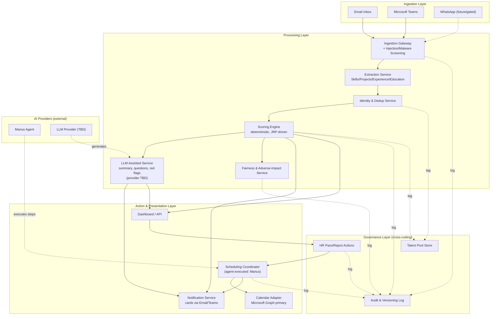

# HR Digital Employee — System Design

**Status:** Draft — architecture-level content complete; infrastructure decisions pending (see §10)
**Input:** [requirement.md](./requirement.md)
**Scope:** Full system — Workflow A (Screening) and Workflow B (Scheduling)

---

## 1. Architecture Overview

The system is organized as a set of loosely-coupled services around three data-flow stages —
**Ingestion → Processing → Action** — with a **Governance layer** (audit, fairness, human-in-loop
gates) that every stage must pass through. This mirrors the SOP's own structure: nothing that
influences a candidate's outcome is allowed to skip logging, verification, or a human checkpoint.

Key property of this layout: **the Scoring Engine and LLM-Assisted Service are separate components**,
not one blended step. This directly implements FR-9 (SOP 2.3.1) — the LLM must be architecturally
incapable of writing to a score/tier/gating field, not just instructed not to.

### 1.1 AI Integration Model

Two distinct AI touchpoints exist in this design, deliberately split by the *shape* of task each is
suited for:

| AI touchpoint | Powers | Why this split |
|---|---|---|
| **Manus (autonomous agent)** | Scheduling Coordinator (§3.9); optionally intake channel monitoring | Multi-step, tool-using, real-world-interacting tasks (check calendars, poll interviewers, wait on candidate responses, retry, escalate) — Manus's strength. Scheduling logistics never touch candidate scoring/fairness, so agent autonomy here doesn't threaten the deterministic/LLM separation principle. |
| **LLM Provider (TBD — second provider, not yet chosen)** | LLM-Assisted Service (§3.5): summary, interview questions, red-flag hints | Needs tightly-scoped, single-shot, auditable generation with sentence-level source anchoring (FR-10) — a low-autonomy, high-constraint job. An autonomous agent is the wrong shape for this; a standard LLM API call inside a controlled service is the right one. |

**Guardrail (applies to Manus specifically):** Manus must act only through the fixed tool
interfaces already defined in this design (Calendar Adapter, Notification Service) — never with
raw calendar/database credentials. The retry-count, timeout, and escalation thresholds (3 rounds,
7-day window, 72h/48h candidate timeouts) are enforced by the Scheduling Coordinator's state
machine *outside* the agent — Manus executes steps within those bounds, it does not decide when to
stop retrying or escalate. Every agent action emits an Audit Log event like any other component
call (§3.12), so agent behavior is reviewable exactly like a deterministic service's would be.

---

## 2. Guiding Architectural Principles

These are constraints the design must satisfy, traced to the SOP/requirement.md:

| Principle | Requirement source | Design implication |
|---|---|---|
| Deterministic/LLM separation | FR-9, FR-10 | Scoring Engine and LLM service are separate processes with a one-way data flow (extraction → score; extraction → LLM). LLM output writes only to summary/question/flag fields, never to score/tier tables. |
| Untrusted input by default | NFR-3, FR-3, FR-4 | All resume text passes through the Ingestion Gateway's screening step before reaching extraction or any LLM — this is a mandatory pipeline stage, not optional middleware. |
| Human-in-the-loop is structural | FR-13, FR-14 | There is no code path from Score → candidate status. Status changes only through an explicit HR_ACTION event. |
| Everything auditable | NFR-5, FR-14, FR-20 | Every service that produces a decision-relevant output emits an event to the Audit Log (append-only) — this is a shared cross-cutting concern, not per-service logging. |
| Fail safe / revertible | NFR-6 | Each processing stage has a defined degrade-to-manual path (queue) rather than a silent failure or default-approve/reject. |
| Least privilege | NFR-4 | Calendar Adapter requests Free/Busy scope only for discovery; a separate, narrowly-scoped service identity performs booking. |

---

## 3. System Components

### 3.1 Ingestion Gateway
- Receives resumes from Email and Teams (WhatsApp adapter added later, same interface).
- Performs: attachment sandboxing/malware scan, hidden-text/injection-pattern stripping
  (SOP 2.1.2), file-format validation.
- Unparseable or suspect files route to a **Manual Review Queue**, never dropped silently.
- Emits an `IntakeReceived` audit event before handing off to Extraction.

### 3.2 Extraction Service
- Parses PDF resumes into the four structured pillars: Skills, Projects, Working Experience,
  Education.
- Attaches a confidence score per field.
- Fields below the must-have confidence threshold (85%) are marked `Unverified` and routed to
  manual review — never coerced into "Not Met" (FR-3).
- Versioned (parser version stamped on every output, per NFR-5).

### 3.3 Identity & Dedup Service
- Matches incoming candidates against existing profiles by email, phone, and name+resume
  similarity, across channels.
- Confident matches merge automatically (most recent resume becomes canonical, prior versions
  retained in history); ambiguous matches flag to HR (never auto-merged).
- Maintains one identity per person across multiple roles, with separate per-role score records.

### 3.4 Scoring Engine
- Pure, deterministic component. Input: structured extraction output + JRP definition. Output:
  score, tier, matching breakdown.
- Sequence: must-have gate check → weighted dimension scoring (per configured curve) → normalize
  to 0–100 → tier classification.
- Has zero dependency on any LLM output or raw resume free text — only structured fields.
- JRP configuration (weights, must-have flags, curves) is versioned and audit-logged on every
  change (FR-6–FR-8). Weight templates ship with the five presets in requirement.md FR-6
  (General 40/30/15/15, Senior technical 35/35/10/20, Junior/graduate 45/5/30/20, Managerial
  25/30/15/30, Licensed/compliance 50/20/20/10) as starting points HR can fine-tune per JRP.
- Tier classification defaults to High Match 80–100%, Mid Match 60–79%, Low Match below 60%
  (FR-31) — configurable per JRP, but the defaults must ship, not be left undefined.
- Keyword/skill matching within the weighted calculation is backed by a skill ontology (FR-27) so
  equivalent phrasings resolve to the same underlying skill — this is a fairness mitigation
  (design.md §3.6 depends on this existing, not the other way around).

### 3.5 LLM-Assisted Service
- Consumes structured extraction output (not raw resume text as instructions) to generate:
  the factual summary, suggested interview questions, red-flag hints.
- Every summary sentence carries a source-passage anchor; unanchored sentences are dropped before
  output (FR-10).
- Powered by a standard LLM API call (provider TBD — a second, not-yet-chosen provider, per §1.1)
  — a single-shot, tightly-scoped generation call, not an autonomous agent. This is deliberate:
  the anchoring/no-hallucination guarantee is much easier to enforce on a constrained one-shot
  call than on an agent with freedom to take multiple actions.
- Runs a **monthly sampled hallucination audit** process (compares generated summaries to
  source resumes) as an operational, not architectural, control — but the *hook* to run this audit
  is a design requirement here.

### 3.6 Fairness & Adverse-Impact Service
- Runs asynchronously against a JRP's historical/live selection data (not per-candidate, real-time).
- Computes four-fifths-rule selection rates by protected characteristic (from voluntarily
  collected, separately-stored demographic data).
- Flags are surfaced to HR/JRP owners for review — this service has no write path back into the
  Scoring Engine or candidate records (FR-20, FR-21).
- Triggered pre-deployment, at minimum quarterly, **and whenever a JRP's weights or must-have
  rules change** (FR-20) — not on a fixed calendar alone.
- Owns the skill-ontology/synonym mapping table consumed by the Scoring Engine (§3.4) as a
  phrasing/language-bias mitigation (FR-27); this service maintains the ontology, the Scoring
  Engine only reads it during matching.

### 3.7 Notification Service
- Renders and delivers notification cards to Email/Teams, respecting channel format constraints
  (WhatsApp's approved-template rules, once that channel exists).
- Delivers scheduling-related messages (poll invites, confirmations) — shared by both workflows.

### 3.8 Dashboard / API
- Web-based interactive view: pipeline overview, filtering, candidate drill-down, comparison
  tables.
- Surface for the explicit HR Pass/Reject action (FR-14) — this is the *only* place candidate
  status changes.
- Surface for JRP configuration (§3.4) and fairness flag review (§3.6).

### 3.9 Scheduling Coordinator
- Runs the consensus-then-candidate-confirmation loop (SOP 3.3–3.5): slot discovery → internal
  poll → candidate confirmation → booking, with retry/widen/escalate state machine.
- Owns timeout logic (candidate 72h + 48h, vote timeouts) and escalates to a human coordinator
  after 3 rounds or no availability within 7 days (FR-17).
- Talks to calendars only through the Calendar Adapter — never directly to Google/Microsoft APIs.
- **Execution model**: the step-by-step work (checking availability, sending polls, waiting for
  responses, retrying) is carried out by the **Manus agent** (§1.1), operating only through this
  component's defined tool interfaces (Calendar Adapter, Notification Service). The state machine
  itself — retry counts, timeout thresholds, escalation triggers — is deterministic and owned by
  this component, not left to the agent's judgment. Manus executes within those bounds; it cannot
  unilaterally extend a deadline or skip an escalation.

### 3.10 Calendar Adapter
- Unified Free/Busy interface abstracting the underlying provider (Microsoft Graph now; Google
  Calendar structurally supported but not required — see Open Questions).
- Two distinct credentials: a read-only Free/Busy identity used broadly, and a narrowly-scoped
  booking identity used only at event-creation time (NFR-4).
- Booking calls are idempotent (unique key per booking attempt) to satisfy FR-18.

### 3.11 Talent Pool Store
- Holds tagged candidate records for future search, independent of any specific role's pipeline
  (skill/experience/education/industry tags per FR-24, e.g., `#Python`, `#5YearsExp`, `#MBA`).
- Subject to retention rules (24-month default deletion/anonymization, 30-day deletion on
  consent withdrawal) — enforced by a scheduled retention job, not manual cleanup.
- Also holds post-interview candidate feedback (FR-28–FR-30): stored as profile context only, in
  a `Feedback` record scoped to predefined competency dimensions plus a free-text remark. This
  store has **no write path into the Scoring Engine (§3.4) or JRP configuration** — feedback data
  physically cannot reach scoring unless a future, explicitly-approved change routes it through
  the Fairness Service's adverse-impact gate (§3.6) first, per FR-30.

### 3.12 Audit & Versioning Log
- Append-only store. Every write is (actor, timestamp, action, reason, version).
- Feeds: Pass/Reject decisions, JRP changes, fairness flags, injection-detection events, scoring-
  engine/parser version per candidate score.
- Supports the layered-retention split in SOP 4.3 (identifiable data erasable; pseudonymized
  decision logs retained for their own defined period).

---

## 4. Data Architecture

### 4.1 Core Entities

| Entity | Key attributes | Notes |
|---|---|---|
| `Candidate` | identity keys (email/phone/name), profile status | One record per person, across roles (§3.3) |
| `Application` | candidate ref, role/JRP ref, status, current tier | Per-role instance of a candidate's pipeline |
| `Resume` | file ref, parsed fields, confidence scores, parser version | Prior versions retained on re-submission |
| `JRP` (Job Requirement Profile) | role type, weights, must-have flags, curves, version | Versioned; every change audit-logged |
| `Score` | application ref, JRP version, total score, tier, breakdown | Immutable once produced; new engine version -> new Score record, not overwrite |
| `Summary` / `InterviewQuestions` / `RedFlags` | application ref, generated text, source anchors | LLM-produced, tagged with model/prompt version |
| `Decision` | application ref, actor, action (Pass/Reject), reason, timestamp | Drives all status transitions |
| `Feedback` | candidate ref, competency ratings (predefined dimensions, 1–5), free-text remark, actor, timestamp | Profile context only (FR-28); no write path to `JRP` or `Score` |
| `Interview` | application ref, participants, slots, state (polling/confirmed/escalated) | Owned by Scheduling Coordinator |
| `ConsentRecord` | candidate ref, consent type (application / talent-pool), timestamp, withdrawal date | Talent-pool consent is separate/unbundled (FR-22) |
| `AuditEvent` | actor, entity ref, action, reason, timestamp, version | Append-only |

### 4.2 Data Store Shape (indicative, not a product choice)
- A **relational store** fits best for Candidate/Application/JRP/Score/Decision — this data is
  highly structured, needs referential integrity (one candidate, many applications), and the
  audit/versioning model benefits from transactional guarantees.
- **Document/blob storage** for raw resume files and parsed-field JSON.
- **Append-only log store** for AuditEvent — could be the same relational engine with an
  insert-only table, or a dedicated log/event store, depending on scale and existing IT standards.

*(Specific product — PostgreSQL, SQL Server, Cosmos DB, etc. — depends on the platform decision in
§10.)*

---

## 5. Integration Architecture

| Integration | Direction | Trust boundary | Notes |
|---|---|---|---|
| Email inbox | Inbound | Untrusted | Attachments sandboxed before Extraction touches them |
| Microsoft Teams | Inbound/Outbound | Untrusted (inbound), trusted (outbound cards) | Notification card format constraints apply |
| WhatsApp Business API | Inbound/Outbound (future) | Untrusted (inbound) | Candidate-initiated only; 24h session window governs outbound; requires business verification before go-live |
| Microsoft Graph (Calendar) | Bi-directional | Trusted, but scoped | Free/Busy scope for discovery; separate booking identity; **primary calendar provider per your answer** |
| Google Calendar | Bi-directional (optional) | Trusted, but scoped | SOP assumes dual-calendar; **not required per your input — flagged in Open Questions** |
| LLM Provider (content generation) | Outbound (structured data only) | Semi-trusted | Receives only screened, structured extraction output — never raw untrusted resume text as "instructions"; single-shot API calls, no agent autonomy; **specific provider not yet chosen (§10)** |
| Manus (agent) | Bi-directional, via tool interfaces only | Semi-trusted, scoped | Drives the Scheduling Coordinator's steps (§3.9) and optionally intake channel monitoring; never given raw calendar/database credentials — only the Calendar Adapter and Notification Service tool interfaces; every action audit-logged |

---

## 6. Security Architecture

- **Threat model**: every inbound document/message is untrusted until it passes the Ingestion
  Gateway's screening (SOP 5.1). This is enforced as a pipeline stage every intake channel must
  pass through — there is no direct channel-to-Extraction path.
- **Injection defense**: hidden-text stripping and instruction-pattern detection happen before
  extraction output is finalized; a match triggers automatic red-flagging and human routing
  (SOP 2.1.2), not silent filtering.
- **Least privilege & credential hygiene**: distinct service identities for (a) reading calendar
  Free/Busy, (b) creating calendar events, (c) reading resumes, (d) writing to the Talent Pool.
  No single credential spans read+write across unrelated domains (SOP 5.2). Credentials rotate on
  a fixed schedule; all use is logged to the Audit Log.
- **Data access separation**: the Scheduling Coordinator can read only the candidate summary it
  needs to distribute — not the full resume or Score breakdown.
- **Agent scoping (Manus)**: the agent is granted access only to the specific tool interfaces it
  needs (Calendar Adapter, Notification Service) — never direct calendar-provider credentials or
  database access. It cannot read resumes, scores, or JRP data. Retry/escalation limits are
  enforced by the Scheduling Coordinator's state machine, not by agent self-restraint. Every tool
  call the agent makes is logged to the Audit Log with the same (actor, timestamp, action) shape
  as any other component — "actor" for agent-initiated actions is recorded as the agent identity,
  not a human, so agent vs. human actions remain distinguishable in the audit trail.

---

## 7. Non-Functional Requirements Mapping

| NFR (from requirement.md) | Architectural mechanism |
|---|---|
| NFR-1 (95% parsing accuracy) | Extraction Service versioned + validated against a held-out annotated set before its output is allowed to drive automatic gating; below-threshold state routes to manual queue by design |
| NFR-2 (1-business-day SLA on manual queue) | Manual Review Queue is a first-class entity with age/depth metrics, alerting the named owner on breach |
| NFR-3 (untrusted input) | Ingestion Gateway is a mandatory pipeline stage (§6) |
| NFR-4 (least privilege) | Split calendar credentials (§3.10, §6) |
| NFR-5 (version stamping) | Score and Summary records carry engine/parser/model version fields; a hiring round is pinned to one version by application-level rule, not database constraint alone |
| NFR-6 (auto rollback) | A monitoring job compares live metrics against baseline; breaching a threshold flips the system into "human-assisted mode" — a configuration flag that disables auto-gating/auto-scheduling without any data migration |

---

## 8. Deployment Topology (indicative — pending §10 decisions)

Regardless of the specific cloud chosen, the design assumes:
- Separate environments: **dev / staging / production**, with production data never copied down
  to lower environments (candidate PII).
- The Scoring Engine and Fairness Service run in isolation from components with internet-facing
  input paths (Ingestion Gateway), so a compromised intake channel cannot directly reach scoring
  logic.
- The Audit Log is backed up/retained independently of the primary application data store, since
  its retention period (tied to legal/appeal windows) may outlive the candidate record itself
  (SOP 4.3).

---

## 9. Framework/Technology Options (not yet decided — see §10)

Since the tech stack, cloud platform, and LLM integration model are still open, here are the
*shapes* of decision to be made, without picking one:

- **Backend**: a typed, statically-checked language/framework tends to fit this domain well
  (lots of structured business rules — weights, thresholds, state machines) — e.g. .NET, or
  TypeScript/Node with a strict setup, or Java/Kotlin. Choice should follow your team's existing
  standard once known.
- **Frontend (Dashboard)**: any modern SPA framework (React, Vue, Blazor if staying in the
  Microsoft ecosystem) — no strong architectural constraint either way.
- **Resume parsing**: build vs. buy is a real fork — a managed document-intelligence service
  (e.g., Azure AI Document Intelligence, AWS Textract) vs. a custom NLP pipeline. This materially
  affects §3.2's implementation but not its interface.
- **LLM integration model**: resolved for Manus's role (§1.1) — Manus drives the Scheduling
  Coordinator's agentic steps. The *second* LLM provider for content generation (§3.5) is still
  unchosen — see Open Questions.

---

## 10. Open Questions (need answers before this design can be finalized)

1. **Cloud platform** — you indicated "not sure / no preference." Given Microsoft 365 is your
   primary environment (from requirement.md), Azure would minimize integration friction (native
   Graph API, Entra ID auth, Azure AI Document Intelligence) — but this is a recommendation, not
   a decision. Should I proceed assuming Azure as a working default for the rest of this design,
   or leave it fully open until IT weighs in?
2. **Second LLM provider (content generation)** — resolved that Manus drives scheduling/agentic
   tasks (§1.1), and a second, not-yet-chosen LLM provider powers the summary/question/red-flag
   generation in §3.5. Which provider (Claude, OpenAI, Azure OpenAI, other) — or is this still to
   be decided later, e.g. once a build team is in place?
3. **Manus scope confirmation** — I've scoped Manus to the Scheduling Coordinator (§3.9) and
   optionally intake channel monitoring (§1.1), based on task fit rather than a specific
   instruction from you. Please confirm this matches your intent, particularly whether you also
   want Manus (rather than the second LLM provider) involved in intake channel monitoring, or
   want that left to plain integration code (email/Teams webhooks) with no AI involved at all.
4. **Tech stack standard** — flagged "not sure yet." Should I recommend a stack based purely on
   the workload (as sketched in §9), or hold that section open until your engineering/IT
   leadership confirms an existing standard?
5. **Data residency** — flagged "need Legal/IT input." Until resolved, this design assumes data
   *can* be regionally constrained (the architecture doesn't hardcode a region), but the specific
   hosting region in §8 is a placeholder. Please treat §8 as non-final until Legal confirms.
6. **Build vs. buy for resume parsing** — do you want a recommendation weighing a managed
   document-intelligence API against a custom NLP pipeline, or is this decision deferred to
   whichever team eventually builds this?
7. **Scale expectations** — roughly how many resumes/month and how many concurrent interview
   scheduling loops should this be designed for? This affects whether a simpler
   monolith-with-modules design suffices or whether the components in §3 need to be independently
   scalable services from day one.

---

## 11. Traceability

Every component and data entity above maps back to a requirement in
[requirement.md](./requirement.md) (FR-1 through FR-23, NFR-1 through NFR-6). No component was
added beyond what a requirement calls for; no requirement was left without a home in this design.
